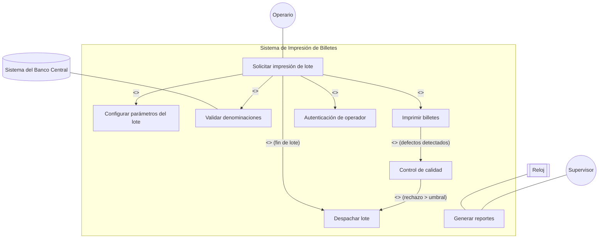
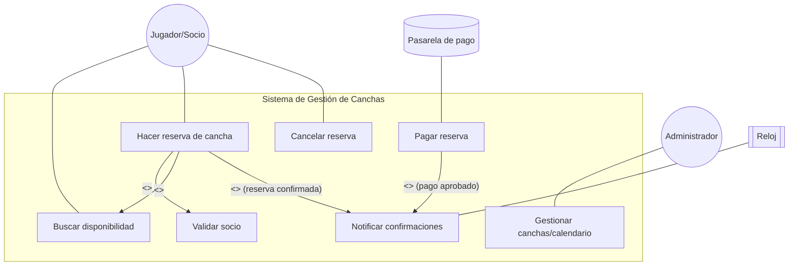

---

# Ejercicio 1 — V/F (con fundamento breve)

- **“Los actores… roles, personas, dispositivos u otros sistemas” → VERDADERO.** Un actor es un _rol_ externo (persona/sistema/dispositivo) que interactúa con el sistema (no es parte del sistema).
    
- **“Los Casos de Uso… permiten acordar límites y requerimientos funcionales” → VERDADERO.** El diagrama + especificaciones fijan alcance funcional y frontera del sistema (qué hace y para quién).
    
- **“La especificación de un CU describe _cómo_ se implementa” → FALSO.** Un CU describe **qué** hace el sistema (comportamiento observable), no su implementación interna.
    
- **“Cursos alternativos modelan errores/excepciones (desvíos del curso básico)” → VERDADERO.** Son variaciones del flujo ideal: validaciones fallidas, datos inválidos, etc.
    

---

# Ejercicio 2 — Elementos del diagrama (guía para responder)

Como el enunciado dice “considere el siguiente diagrama” pero no está visible, te dejo el guion para contestar:

1. **Nombrar elementos de notación** (lo usual que te van a evaluar):
    

- Actores (muñequitos o rectángulos estereotipados externos).
    
- Casos de uso (óvalos con nombre verbal).
    
- **Límites del sistema** (rectángulo que encierra los CU).
    
- Relaciones:
    
    - Asociación actor–caso.
        
    - **<>** (flecha punteada con etiqueta hacia el CU incluido).
        
    - **<>** (flecha punteada con etiqueta desde el CU extendido al base, opcional “extension points”).
        
    - **Generalización** de actores o de casos (flecha con triángulo hueco).
        

2. **Interpretación breve**  
    Identificar: actores primarios, objetivos principales (CU), dependencias comunes (includes), variaciones condicionales (extends) y si hay especializaciones (generalización). Mencionar en 2–3 líneas el _alcance funcional_ que se percibe.
    

> Si querés, pegame una captura y lo corrijo en el acto con nombres y lectura precisa.

---

# Ejercicio 3 (Enunciado 1: **Sistema de Impresión de Billetes**)

_(Modelo completo y listo para ajustar si tu cátedra trae narrativa propia)_

## a) Actores y Casos de Uso (diagrama)

### Actores

- **Operario (primario)**: solicita e instrumenta la impresión.
    
- **Supervisor (secundario)**: consulta reportes, aprueba despacho.
    
- **Sistema del Banco Central (secundario)**: valida denominaciones vigentes/tablas.
    
- **Reloj (actor temporal)**: dispara reportes programados (si tu cátedra lo pide después, lo reutilizamos en Ej. 16).
    

### Casos de Uso (lista y breve descripción)

- **Solicitar impresión de lote**: inicia un lote de impresión (tamaño, serie, denominación, sustrato).
    
- **Configurar parámetros del lote** (_include_): define tirada, numeración, insumos.
    
- **Validar denominaciones** (_include_): consulta/valida contra BCRA denominaciones vigentes.
    
- **Imprimir billetes**: ejecuta el proceso de impresión y numeración.
    
- **Control de calidad** (_extend_): sólo si se detectan defectos/umbral de muestreo.
    
- **Despachar lote** (_extend_ desde impresión o QA*): prepara y registra salida a logística.
    
- **Generar reportes**: consolida producción, tasas de rechazo, series.
    

## b) Especificación breve (1 párrafo por CU)

- **Solicitar impresión de lote**: El operario inicia un nuevo lote indicando denominación y volumen. El sistema obliga a autenticarse, pide parámetros del lote y verifica con el BCRA que la denominación esté permitida. Si todo es válido, habilita el arranque de máquinas y registra el lote.
    
- **Configurar parámetros del lote**: Se cargan tirada, rango de numeración, sustratos/tintas y líneas habilitadas. Persisten como parte del lote.
    
- **Validar denominaciones**: Se consulta catálogo oficial; si la denominación está deprecada o no existe, se rechaza.
    
- **Imprimir billetes**: Ejecuta el ciclo de impresión con monitoreo de sensores y registro de incidencias.
    
- **Control de calidad (extend)**: Muestreo automático; si defectos superan umbral, se detiene y se reconfigura/reprocesa.
    
- **Despachar lote (extend)**: Embalado, sellado, guía de despacho y traza para transporte.
    
- **Generar reportes**: Permite al supervisor ver producción por fecha/serie, rechazos, eficiencia.
    

## c) **Especificación detallada** del/los CU de **impresión** (ejemplo completo)

### CU: Imprimir billetes

- **Actor primario**: Operario
    
- **Trigger**: Lote validado y configurado.
    
- **Precondiciones**: Operario autenticado; denominación válida; insumos OK.
    
- **Postcondiciones**: Lote queda en estado _impreso_ (total, parciales y rechazados registrados).
    
- **Relaciones**:
    
    - _Include_: Configurar parámetros del lote, Validar denominaciones (ya corridos antes).
        
    - _Extend_: **Control de calidad** (condición “muestra con defectos ≥ umbral”). **Despachar lote** (condición “fin de lote sin observaciones”).
        
- **Curso básico**
    
    1. El Operario inicia la impresión del lote.
        
    2. El Sistema verifica disponibilidad de línea y sensores.
        
    3. El Sistema arranca la impresión y numera billetes.
        
    4. Se contabiliza progreso y se registran incidencias.
        
    5. Al completar la tirada, el Sistema marca lote _impreso_.
        
    6. _[Condición]_ Si no hubo observaciones, **<> Despachar lote**.
        
    7. El CU finaliza.
        
- **Cursos alternativos**
    
    - **A1—Fallo de sensor**: 2.a Se pausa impresión, se notifica; al reanudar, volver a paso 3.
        
    - **A2—Muestreo defectuoso**: 4.a Disparo de **<> Control de calidad**.
        
    - **A3—Insumos insuficientes**: 2.a Se solicita recarga; al reponer, volver a 2.
        

### CU extendido: Control de calidad

- **Trigger**: Condición de muestreo/defectos.
    
- **Básico**: toma muestra, mide defectos, si ≤ umbral → retorna a impresión; si > umbral → detener, registrar no conformidad, solicitar ajuste.
    

## d) Diferencias/similitudes con **User Stories**

- **US**: “Como Operario, quiero iniciar un lote de $1000 para completar 50k unidades”. Enfocada en _valor al usuario_ y criterio de aceptación.
    
- **CU**: especifica **flujos, pre/post**, actores secundarios, variantes (errores), e **incluye/extiende** comportamiento común o condicional.
    
- **Similitud**: Ambas capturan necesidad funcional.
    
- **Diferencia**: **CU profundiza** en el contrato de interacción y excepciones; **US** prioriza backlog y pruebas de aceptación.
    

---

# Ejercicio 4 — **Sistema de gestión de canchas** (modelo útil para tu app de depósito/canchas)

## a) Actores y Casos de Uso (diagrama)

### Casos de Uso (breve)

- **Buscar disponibilidad**: consulta canchas por fecha, hora, deporte.
    
- **Hacer reserva de cancha**: el socio elige franja libre y confirma. _Incluye_ validar socio y _buscar_.
    
- **Pagar reserva**: integra pasarela, registra resultado.
    
- **Cancelar**: aplica reglas (ventana, penalidad).
    
- **Gestionar canchas/calendario**: el admin define canchas, horarios, bloqueos.
    
- **Notificar** (extend): envía email/app al confirmar o pagar.
    
- **Validar socio** (include): verifica datos/categoría/estado.
    

## b) Especificación breve (1 párrafo por CU)

- **Hacer reserva de cancha**: El socio inicia la reserva; el sistema valida su condición, muestra disponibilidad y, al seleccionar franja, bloquea el slot y guarda la reserva. Opcionalmente deriva a pago y notifica confirmación.
    

## c) Especificación detallada — **Hacer reserva de cancha**

- **Actor primario**: Socio
    
- **Trigger**: Solicita reservar.
    
- **Precondiciones**: Socio identificado; catálogo de canchas cargado.
    
- **Postcondiciones**: Reserva en estado _pendiente_ o _confirmada_.
    
- **Relaciones**: _include_ (**Validar socio**, **Buscar disponibilidad**), _extend_ (**Notificar**, al confirmar).
    
- **Curso básico**
    
    1. El Socio solicita reservar.
        
    2. El Sistema **incluye Validar socio**.
        
    3. El Sistema **incluye Buscar disponibilidad** por deporte/fecha/hora.
        
    4. El Socio selecciona cancha y franja.
        
    5. El Sistema bloquea slot y registra la reserva.
        
    6. **[Opcional]** redirige a **Pagar reserva**; si pago aprobado → **<> Notificar**.
        
    7. Finaliza.
        
- **Alternativos**
    
    - **A1—Sin disponibilidad**: informar y permitir cambiar criterios.
        
    - **A2—Socio no válido**: cancelar CU con mensaje.
        
    - **A3—Timeout de pago**: mantener _pendiente_ con vencimiento.
        

## d) Comparación con **User Stories**

- US: “Como socio quiero reservar una cancha de pádel el sábado a las 18 para asegurar un horario con amigos.”
    
- CU: detalla validaciones, bloqueos de slot, relación con pago y notificaciones.
    

---

## Cómo seguir (Ej. 5 a 15 y 16–19)

- **Ej. 5 (“La Pulga”) / 6 (Puntos limpios) / 7–13**: dependen de las narrativas del TP Base. Con la estructura de arriba, en 10–15′ por ejercicio los dejás listos: lista de actores, CU, un diagrama Mermaid, párrafos breves, y 1 CU detallado (el que pide cada ejercicio).
    
- **Ej. 14 — V/F sobre relaciones** (guía rápida):
    
    - “El diagrama puede organizarse con generalización, inclusión, extensión” → **V**.
        
    - “Especialización/Generalización entre CU para variar comportamiento o abstraer común” → **V**.
        
    - “Extensión para funcionalidad común” → **F** (eso es **include**).
        
    - “Un CU incluido se activa siempre que se activa el que lo usa” → **V** (el incluido no se ejecuta solo).
        
- **Ej. 15**: revisá tus diagramas de 3–5 para:
    
    - **Factorizar común** con **<>** (p.ej., “Validar usuario”, “Verificar modalidad”, “Autenticar”).
        
    - **Variantes condicionales** con **<>** (“Notificar”, “Control de calidad”, “Generar código de acceso 5′ antes”).
        
    - **Generalización** si hay CU “padre” y “hijos” (misma intención con especialización del flujo).
        
- **Ej. 16** (cambios para Impresión de Billetes):
    
    - **Nuevas denominaciones**: agregar CU **Administrar denominaciones** (Admin/Supervisor) o extender **Validar denominaciones** para “denominación inexistente → alta provisional con aprobación”.
        
    - **Reporte diario 08:00**: **Actor Reloj** dispara **Generar reporte semanal de retiros** (<> desde “Generar reportes” o CU aparte programado).
        
- **Ej. 17–18** (detectar errores en diagramas): checklist típico
    
    - Actores dentro del sistema (incorrecto).
        
    - Relaciones mal orientadas (include/extend).
        
    - Casos que son _tareas técnicas_ internas (no visibles al actor).
        
    - Falta de límite del sistema.
        
    - Uso de generalización cuando correspondía include/extend (o viceversa).
        
    - Ausencia de asociaciones actor–CU.
        

---

¿Querés que te lo deje todo **en un solo PDF** de entrega (con los dos diagramas ya incluidos y plantillas para los otros ejercicios) o preferís que sigamos ejercicio por ejercicio completando las narrativas que te vayan dando?