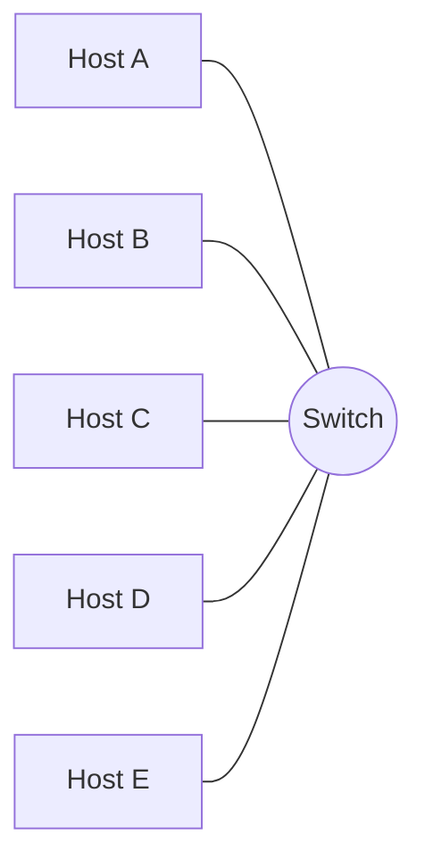
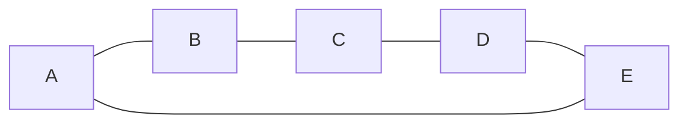
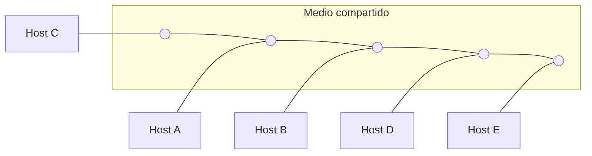
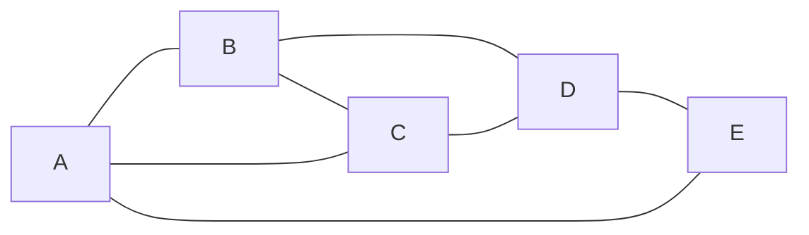
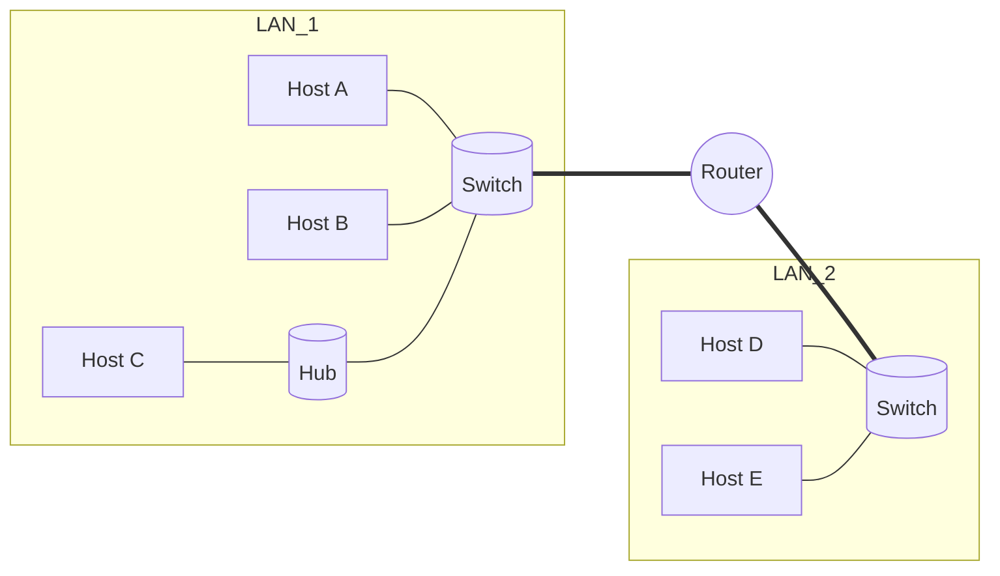

¡Vamos! Resuelvo el práctico apoyándome en tus PDFs. Donde haga falta “dibujar”, uso **Mermaid**.

---

# 1) Tabla de tecnologías (completa)

(De “Práctico 1” y “Funcionamiento Internet”)

| Tecnología            | Clasificación (alcance) | Norma(s)                     | Uso pensado                            | Velocidad típica                        | Medio                        |
| --------------------- | ----------------------- | ---------------------------- | -------------------------------------- | --------------------------------------- | ---------------------------- |
| Ethernet              | LAN                     | IEEE 802.3                   | Redes cableadas (hogar, oficina, DC)   | 100 Mb/s – 1/10/25/40/100 Gb/s          | UTP/STP, fibra, coax (hist.) |
| Wi-Fi                 | LAN                     | IEEE 802.11 a/b/g/n/ac/ax/be | Acceso inalámbrico local               | 54 Mb/s → >1 Gb/s (ax/be)               | Radio (2.4/5/6 GHz)          |
| Bluetooth             | PAN                     | Bluetooth Core Spec          | Conexión corta distancia (periféricos) | ~1–3 Mb/s (CL); BLE < 1 Mb/s (efectivo) | Radio 2.4 GHz                |
| ADSL                  | Acceso (última milla)   | ITU-T G.992.x                | Acceso hogar por par de cobre          | ↓ hasta ~24 Mb/s; ↑ < 1–3 Mb/s          | Par telefónico               |
| Cablemodem            | Acceso (última milla)   | DOCSIS                       | Acceso hogar por TV coaxial            | ↓ cientos de Mb/s–Gb/s                  | Coaxial                      |
| Telefonía móvil 4G/5G | MAN/WAN                 | 3GPP LTE/NR                  | Acceso móvil de banda ancha            | 4G: 100–300 Mb/s; 5G: >1 Gb/s           | Radio celular                |

---

# 2) Conversión de unidades

(“Práctica Store and Forward” trae tablas de unidades)

- 150 Mb/s → **18.75 MB/s** (÷8)
    
- 5 Gb/s → **625,000 KB/s** (5×10⁹ b/s ÷8 = 6.25×10⁸ B/s = 625,000 KB/s)
    
- 1000 Kb/s → **1 Mb/s**
    
- 150 ms → **0.150 s**
    
- 0.1 s → **100,000 µs**
    
- 1 µs → **1000 ns**
    

---
# 3) Tiempo de descarga

Archivo **2 GB** (= 16×10⁹ bits, usando base 10) a **10 Mb/s** →

*Tus cálculos (también correctos):*
2GB son 16Gb, y 16Gb son 16 * 1000 = 1600Mb , 1600Mb/10Mb son 1600 segundos

*Resolución formal:*
t = 16×10⁹ b / 10×10⁶ b/s = **1600 s ≈ 26 min 40 s** (sin overhead).

---

# 4) Topologías (graficadas + comparación)

(Topologías pedidas en el práctico)

## Estrella

## Anillo

## Bus

## Malla (mesh) 5 nodos (parcial)

**Comparación rápida**

- **Costo**: Bus (bajo) < Anillo ≈ Estrella < Malla (alto por enlaces).
    
- **Escalabilidad**: Estrella (alta, agregar puerto) > Anillo (moderada) > Bus (limitado) < Malla (compleja).
    
- **Tolerancia a fallas**: Malla (alta) > Estrella (falla del switch = riesgo central) > Anillo (un corte rompe el ciclo) > Bus (un corte parte el medio).
    
- **Rendimiento/colisiones**: Estrella con switch y Malla (mejor segmentación) > Bus (medio compartido, contención).
    

---

# 5) Servicios (usuario, proveedor, tipo)

(“Práctico 1” + capas/protocolos en “Arquitectura de Niveles”)

- **Consulta de saldo en un cajero**
    
    - Usuario: persona (cliente)
        
    - Proveedor: sistema bancario/host del banco (red ATM)
        
    - Tipo: orientado a la conexión lógico (transacción confiable a nivel app), transporte confiable (TCP u otros propietarios)
        
- **Transferencia de archivo FTP**
    
    - Usuario: programa FTP cliente
        
    - Proveedor: servidor FTP
        
    - Tipo: **orientado a conexión y confiable** (FTP usa TCP)
        
- **Consulta a servidor DNS**
    
    - Usuario: resolver del SO / app
        
    - Proveedor: servidor DNS recursivo/autoritativo
        
    - Tipo: **no orientado a conexión** (UDP 53 típico, con reintentos a nivel app); TCP para zonas y respuestas grandes
        
- **Conversación telefónica celular**
    
    - Usuario: persona
        
    - Proveedor: red móvil del operador
        
    - Tipo: históricamente **conmutación de circuitos** (2G/3G). En 4G/5G con **VoLTE/VoNR** es **packet switching** con establecimiento de sesión (SIP/IMS) y QoS.
        

---

# 6) Mapeo OSI ↔ TCP/IP y rol de cada capa

(“Arquitectura de Niveles”)

- **OSI 1 Físico + 2 Enlace** ↔ **TCP/IP Link Layer**: bits/frames, acceso al medio, detección de errores.
    
- **OSI 3 Red** ↔ **TCP/IP Internet**: direccionamiento y ruteo (IP).
    
- **OSI 4 Transporte** ↔ **TCP/IP Transporte**: extremo a extremo, control de flujo/errores (TCP/UDP).
    
- **OSI 5–7 (Sesión/Presentación/Aplicación)** ↔ **TCP/IP Aplicación**: protocolos de app (HTTP, DNS, etc.).
    

---

# 7) Protocolo diplomático (analogía)

(Consigna del práctico)

Un embajador A escribe a B en otro idioma. **Protocolo**:

- A usa un **formato** (saludo, sello, firma), **idioma acordado** o traductor, y **canal** (valija diplomática).
    
- B al recibir, **verifica sello/firmas** (autenticidad), **traduce**, y responde en el **mismo formato**.  
    Esto refleja **acuerdos de sintaxis, semántica y procedimientos** (como un RFC) entre **usuarios** (embajadas) sobre un **medio** (correo/valija).
    

---

# 8) ISP y niveles. POP e IXP

(“Funcionamiento Internet”)

- **ISP**: proveedor que vende **capacidad de comunicación**.
    
- **Tier-1** (global), **Tier-2** (nacional), **Tier-3** (local/última milla).
    
- **Peering** (entre pares, sin cobro) y **Transit** (pago a uno mayor).
    
- **POP**: punto de presencia del ISP (sala con equipos para dar servicio en un área).
    
- **IXP**: punto físico donde **varios AS/ISP** intercambian tráfico (menos costo/latencia, mejor regionalización). Ej. **CABASE** en AR.
    

---

# 9) Segmento, datagrama y trama + direcciones

(“Práctico 1” + “Arquitectura de Niveles”)

- **Segmento** (Transporte, p.ej. TCP/UDP): usa **puertos** (e.g., TCP src 49152, dst 80).
    
- **Datagrama** (Red, IP): usa **direcciones IP** (e.g., 192.0.2.10 → 203.0.113.5).
    
- **Trama** (Enlace, Ethernet): usa **MAC** (e.g., 00:11:22:33:44:55 → 66:77:88:99:AA:BB).
    

---

# 10) ¿Qué capas procesa cada dispositivo? + esquema

(“Práctico 1” + “Arquitectura de Niveles”)

- **Hub**: **capa 1** (repite señales).
    
- **Switch**: **capa 2** (conmuta por MAC; segmenta colisiones).
    
- **Router**: **capa 3** (rutea por IP; separa dominios de broadcast).
    
- **Host**: procesa **todas las capas** (1–4/7).
    

---

# 11) Canal 100 Mb/s, dp=1 µs, frame 1500 B

(“Introducción.pdf”: fórmulas dp, Vt, Tb, L/R)

- **R** = 100×10⁶ b/s ; **L** = 1500×8 = 12,000 b
    
- **Tb** = 1/R = 0.01 µs (10 ns)
    
- **Ttx** = L/R = 12,000 / 100e6 = **120 µs**
    

a) Llegada del **primer bit**: **dp = 1 µs**  
b) Fin del **primer bit**: **dp + Tb = 1.01 µs**  
c) Fin del **frame completo**: **dp + Ttx = 121 µs**  
d) Si envío **dos frames** con la mitad de bits cada uno, **back-to-back**, el tiempo del último bit = **dp + (Ttx/2 + Ttx/2) = 121 µs** → **no varía**.

---

# 12) Canal 10 Mb/s, dp=5 µs, frame 2500 B

(“Introducción.pdf”)

- **R** = 10×10⁶ b/s ; **L** = 2500×8 = 20,000 b
    
- **Tb** = 1/R = **0.1 µs**
    
- **Ttx** = 20,000 / 10e6 = **2000 µs** = **2 ms**
    

a) Primer bit **comienza** a llegar: **5 µs**  
b) Primer bit **termina** de llegar: **5.1 µs**  
c) Fin del **frame completo**: **5 µs + 2000 µs = 2005 µs (2.005 ms)**

---

# 13) Estrella (con switch) vs punto-a-punto (A-B-C-D)

(Consigna del práctico)

Supuesto: **Store-and-Forward** por salto. Cada salto demora **0.01 s**.

## Topología estrella (A–Switch–X)

- **A→D**: 2 saltos ⇒ **0.02 s**. Carga: **2 transmisiones** (A→S, S→D).
    
- **A→B**: 2 saltos ⇒ **0.02 s**. Carga: **2 transmisiones**.
    
- **Broadcast desde B**: B→S y S→(A,C,D) ⇒ **4 transmisiones**, llegada a cada uno ≈ **0.02 s**.
    

## Punto a punto en línea (A-B-C-D)

- **A→D**: 3 saltos ⇒ **0.03 s**. Carga: **3 transmisiones**.
    
- **A→B**: 1 salto ⇒ **0.01 s**. Carga: **1 transmisión**.
    
- **Broadcast desde B** (por todas sus conexiones): **2 transmisiones simultáneas** (B→A y B→C), cada destino en **0.01 s**.
    

> Intuición: estrella reduce saltos (mejor latencia y menos carga) vs cadena.

---

# 14) S&F: 5000 B, MTU 2000 B, header 10 B, Vt=10 Mb/s, VS=2×10⁸ m/s, enlaces 100 m, dproc=10 µs

(Aplico fórmulas de “Introducción” y “Práctica S&F”)

**Topología asumida**: A—R1—R2—B (3 enlaces, 2 routers), típica del práctico 15.

- **dp por enlace** = 100 m / (2×10⁸ m/s) = **0.5 µs**
    
- **Partición** (payload máx. 1990 B): 5000 B → **3 frames**:
    
    - F1: **2000 B** (1990+10)
        
    - F2: **2000 B**
        
    - F3: **1030 B** (1020+10)
        
- **Ttx** a 10 Mb/s:
    
    - 2000 B → **1.6 ms**
        
    - 1030 B → **0.824 ms**
        

**a) Tiempo total 5000 B** (pipeline S&F, enlaces a misma velocidad):  
Aproximación estándar (H=3 enlaces):  
**T ≈ 3·dp + 2·dproc + 2·Ttx_max + ΣTtx_i**  
= 3·0.5 µs + 2·10 µs + 2·1.6 ms + (1.6 + 1.6 + 0.824) ms  
= **≈ 7.246 ms**

**b) Nº de paquetes por las líneas**: **3 frames** (2000, 2000, 1030 B).  
**c) Buffers mínimos (2 kB c/u) por router para no perder**: con mismas tasas, no se acumula cola sostenida → **1 buffer por interfaz** basta (S&F y tasas iguales).  
**d) Con 4 buffers de 2 kB y 10,000 B de datos**, ejemplo con pérdida: poner **R2→B a 1 Mb/s** y A→R1/R1→R2 a 10 Mb/s ⇒ R2 **acumula** >4×2 kB si llegan frames más rápido de lo que salen → **pérdida en R2**. **Enlace cuello de botella: R2–B**.

---

# 15) S&F: 3000 B, MTU 1000 B, header 40 B, Vt: A–R1=2 Mb/s, R1–R2=2 Mb/s, R2–B=1 Mb/s, VS=5×10⁸ m/s, L=100 m, dproc=10 µs

(“Práctica S&F”: metodología de partición y tiempos)

- **dp por enlace**: 100 / (5×10⁸) = **0.2 µs**
    
- **Payload máx.**: 1000−40 = **960 B** → 3000 B ⇒ **4 frames**:
    
    - F1–F3: **1000 B**; F4: **160 B** (120+40)
        
- **Ttx**:
    
    - a **2 Mb/s**: 1000 B = 8000 b → **4 ms**; 160 B = 1280 b → **0.64 ms**
        
    - a **1 Mb/s**: 1000 B → **8 ms**; 160 B → **1.28 ms**
        

**a) Tamaños y Ttx** → ya indicado arriba (por enlace).  
**b) ¿Cuándo comienza a llegar el 1er bit a B (F1)?**  
≈ Ttx(A–R1, F1) + dp + dproc + Ttx(R1–R2, F1) + dp + dproc + **dp**  
= 4 ms + 0.0002 ms + 0.01 ms + 4 ms + 0.0002 ms + 0.01 ms + 0.0002 ms  
≈ **8.0206 ms**

**c) ¿Cuándo termina de llegar el 1er bit a B?**  
Suma (b) + **Tb en último enlace** (1 Mb/s → 1 µs = 0.001 ms)  
≈ **8.0216 ms**

**d) Tiempo total 3000 B (llega el último bit del F4):**  
“Llenado” hasta empezar último enlace con F1: **≈ 8 ms + 2·dproc + 2·dp ≈ 8.0204 ms**,  
luego cola del **último enlace** (cuello de botella) con **F1..F4**: 8 + 8 + 8 + 1.28 = **25.28 ms**.  
Total ≈ **33.30 ms**.

**e) Buffers mínimos (cap. por buffer = 1000 B) en routers:**

- En **R1** (2→2 Mb/s): tasas iguales → con S&F, **1 buffer** por salida alcanza.
    
- En **R2** (2 Mb/s → 1 Mb/s): llega más rápido de lo que sale → durante los **8 ms** de envío de F1 a 1 Mb/s, **arriban F2 y F3**; para no perder, reservar **≥3 buffers de 1000 B** en la cola de salida de **R2**.
    

---

# 16) (Opcional) Variante S&F: 2000 B, MTU 500 B, header 20 B, Vt A–R1=10 Mb/s, R1–R2=10 Mb/s, R2–B=5 Mb/s, dp=5 µs

(Queda listo para que te lo resuelva igual que 15 cuando me digas y lo grafico si querés.)

---

¿Querés que ahora te deje **todos estos escenarios dibujados** (línea de tiempo S&F por trama) o pasamos a **resolver el 16** con el mismo nivel de detalle?